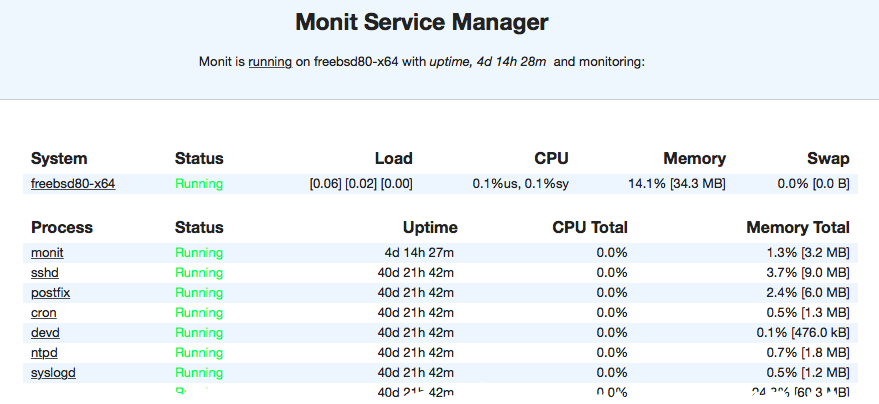
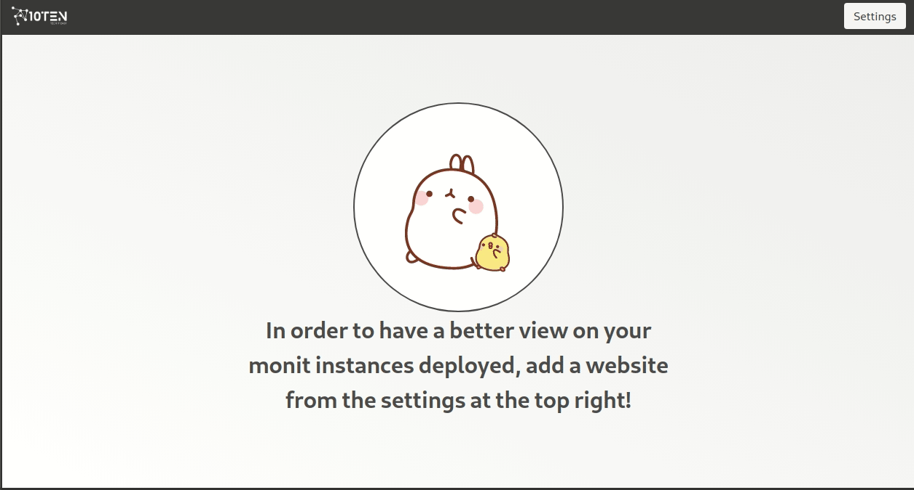

# VisuMonit 10ten

## In this Article:
 - Why did we do build this project
 - What have we used and challenges
 - Contribute

## Why did we build this project:
 
There are not many free monitoring tools on the market. One of the most popular used monitoring tools is [monit](https://mmonit.com/monit/).
Unfortunately unlike the paid version mmnonit, the free version lacks many features. One of the things it's outdated user interface.
As DevOps master, you would want to keep your eyes on status of your servers without manually logging into each server manually. While looking
like a hollywood hacker star in a movie has it perks, sometimes you want to leverage the convenience of having modern dashboard to keep your eyes
on your naughty nodes. Here you can see the latest monit dashboard looking like a website from dot-com bubble age:  
  
  
  
We have decided to change that and bring a slick modern dashboard that would make our lives much easier. We found that monit offers a XML raw output 
and we used that to produce a new beautiful dashboard. We also added many features that would make it more useful: you can import and export for easier
sharing between the development team, we added an option to allow the dashboard to cycle through the different servers incase you have more than one in a
way which you can put it on a big screen in office where everybody can see and keep an eye on the status of your precious node without moving your mouse
or keyboard. We are excited also to point that we decided to make this project open-source as in 10ten we love to contribute back to the community and 
to allow other developers to work with us on making this tool much better.

 

## How to use 

## What have we used and challenges:  
  
The Biggest challenge that this dashboard faces is the need for the CORS header to be configured on your server for the JS to fetch and use the XML output
the monit produce. An exception to this rule is in the case of you deploying this dashboard on the same domain your monit is deployed on. The password 
protected monit takes a step further by requiring these headers for authentication from the server side:
```
Access-Control-Allow-Credentials: true
Access-Control-Allow-Headers: access_token
Access-Control-Allow-Methods: GET
Access-Control-Allow-Origin: *
```
  
For the tools we have used. One of the goal of this dashboard is for it to stay light-weight and not to add extra stress on the server so we decided to go
with the static site approach. To keep the development of the code and pages clean we built a Gulp based static-site generate. Our project's JS supports using module
import and es6 syntax, all will compile to browser compatible code in the build. For the template's it doesn't rely on any heavy libraries like react, we 
used the Mozilla template engine [NunJucks](https://mozilla.github.io/nunjucks/). For the styling we used [Bulma](https://bulma.io/) a beautiful lightweight
alternative to Bootstrap that we like to use in our small projects.  
  
## Contribute  


